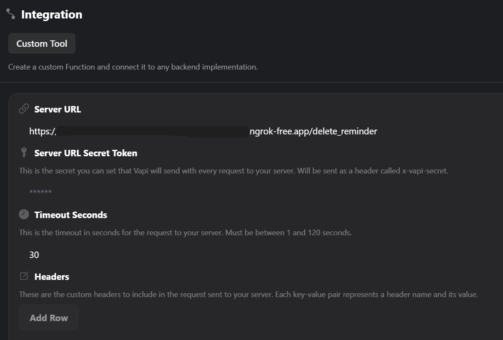
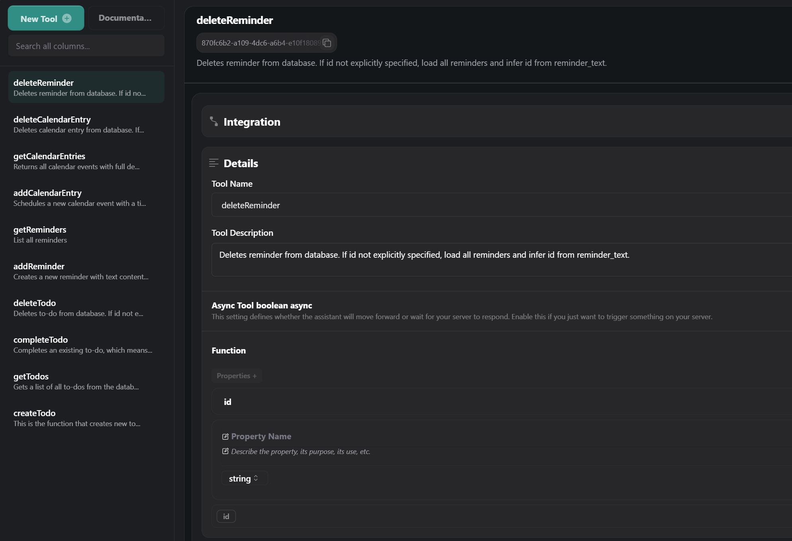
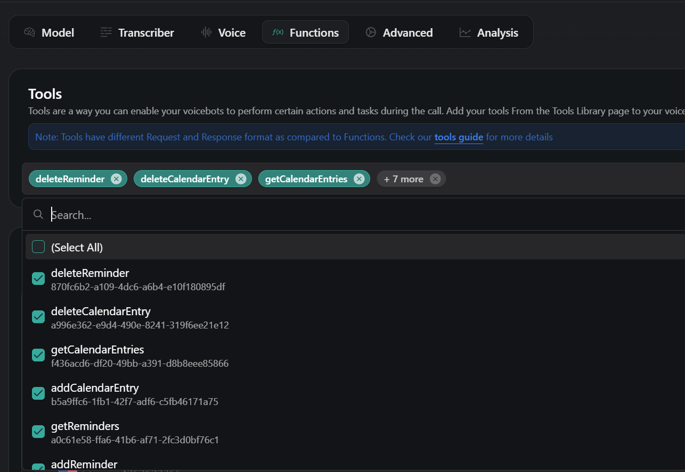
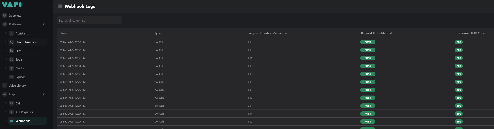
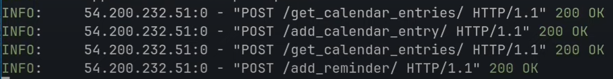

# 🎙️ Voice Assistant VAPI

This is a personal AI voice assistant built in Python. It uses FastAPI for the backend and Vapi to handle voice interactions. The assistant stores data in a SQLite database, allowing it to efficiently manage tasks like to-dos, reminders, and calendar events through voice commands.

## 🚀 Installation & Setup

### Install Dependencies

```sh
pip install -r requirements.txt
```
or manually:
```sh
pip install fastapi sqlalchemy pydantic uvicorn
```

### Start the FastAPI Server
```sh
uvicorn main:app --port 9999
```

## 🌍 Exposing FastAPI with ngrok
Since FastAPI runs on localhost, you need ngrok to expose it to the internet so Vapi can communicate with it.

1. Create an account on [ngrok](https://dashboard.ngrok.com/)
2. Follow the [installation guide](https://ngrok.com/docs/getting-started/)
3. Open a new terminal to make sure that the API is running locally on port 9999
4. Run the following command to generate a public URL (assuming it runs on port 9999):
`.\ngrok.exe http http://127.0.0.1:9999`
5. Use the generated ngrok URL in Vapi to access the API endpoints.

## 🔧 Vapi Configuration

Follow these steps to configure Vapi for this project:

1. Create an account on [Vapi.ai](https://vapi.ai/)
2. Set up your personal voice assistant:

   <p align="center">  </p>

3. Configure functions:

   3.1. Ensure the function name matches what is used in the conditions, e.g.: `if tool_call.function.name == 'deleteReminder':`

   3.2. Use the ngrok public URL + the endpoint name.

   <p align="center">  </p>

   3.3. Add the required parameters:

      Specify type, description, and whether the field is required.
   <p align="center">  </p>

   3.4. Assign functions to the assistant:

   <p align="center">  </p>

   3.5. Start the assistant and test the API calls:

      Use Vapi logs or check API logs locally.
      Verify that data is correctly inserted into the database.
      <p align="center">  </p>
      <p align="center">  </p>
      <p align="center">  </p>


## 🛠️ Features
✅ To-Do Management: Create, retrieve, complete, and delete to-dos.

✅ Reminder Management: Add, retrieve, and delete reminders.

✅ Calendar Management: Add, retrieve, and delete calendar events.

## 📡 API Endpoints

### **📌 To-Do Management**
| Method | Endpoint | Description |
|--------|---------|-------------|
| POST   | `/create_todo/` | Create a new to-do |
| POST   | `/get_todos/` | Get all to-dos |
| POST   | `/complete_todo/` | Mark a to-do as complete |
| POST   | `/delete_todo/` | Delete a to-do by ID |

### **⏰ Reminder Management**
| Method | Endpoint | Description |
|--------|---------|-------------|
| POST   | `/add_reminder/` | Add a new reminder |
| POST   | `/get_reminders/` | Get all reminders |
| POST   | `/delete_reminder/` | Delete a reminder by ID |

### **📅 Calendar Management**
| Method | Endpoint | Description |
|--------|---------|-------------|
| POST   | `/add_calendar_entry/` | Add a new calendar event |
| POST   | `/get_calendar_entries/` | Get all calendar events |
| POST   | `/delete_calendar_entry/` | Delete a calendar event by ID |

## 🗄️ Database
This project uses SQLite as its database for storing and managing tasks efficiently.

| Table Name | Purpose |
|--------|---------|
| todos   | `Stores to-do items` |
| reminders   | `Stores reminders` |
| calendar_events   | `Stores scheduled events` |

## 🤝 Acknowledgments
- Inspiration: YouTube tutorial
- Libraries Used: `fastapi`, `sqlalchemy`, `pydantic`, `uvicorn`, `sqlite`